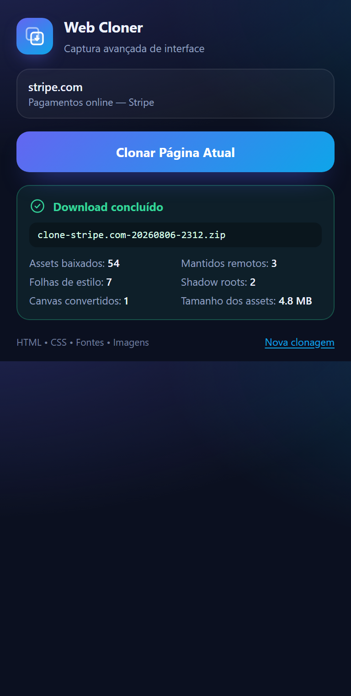

# Web Cloner Avançado

Extensão Chrome (Manifest V3) que clona a interface estática da aba ativa — HTML, CSS, web fonts e imagens — e entrega tudo empacotado em um `.zip` pronto para abrir offline.



---

## Como instalar localmente

1. Abra o Chrome em `chrome://extensions/`.
2. Ative o **Modo do desenvolvedor** (canto superior direito).
3. Clique em **Carregar sem compactação** e selecione a pasta raiz deste projeto (a que contém o `manifest.json`).
4. Fixe a extensão na barra de ferramentas pelo ícone de quebra-cabeça.
5. Abra qualquer site `http`/`https`, clique no ícone da extensão e em **Clonar Página Atual**.

O `.zip` cai na pasta de downloads padrão com o nome `clone-<site>-<data>-<hora>.zip`. Descompacte e abra o `index.html` no navegador.

> **Atualizou o código?** Volte em `chrome://extensions/` e clique no botão de recarregar do card da extensão. Alterações no `content.js` também exigem recarregar a aba alvo.

### Requisitos

- Chrome 116 ou superior (usa `chrome.offscreen` com o motivo `BLOBS`).
- Nenhuma dependência de build: o JSZip já está em `libs/jszip.min.js`.

---

## Estrutura

```text
/
├── manifest.json      Configuração MV3 e permissões
├── popup.html         Interface do painel
├── popup.css          Estilo do painel (CSS puro — a CSP do MV3 proíbe CDNs)
├── popup.js           Lógica da UI e comunicação por mensagens
├── background.js      Service worker: fetch sem CORS, pipeline de CSS, JSZip e download
├── content.js         Motor de captura: DOM, Shadow DOM, canvas, formulários e assets
├── offscreen.html     Documento offscreen (só existe durante o download)
├── offscreen.js       Converte o ZIP em blob: URL
├── libs/jszip.min.js  Empacotamento do .zip
├── icons/             Ícones 16/48/128
└── tools/             Scripts de desenvolvimento (não fazem parte da extensão)
```

Saída gerada dentro do `.zip`:

```text
/index.html
/styles.css
/README.txt          Relatório da captura (o que foi baixado, o que ficou remoto)
/assets/images/
/assets/fonts/
```

---

## Como funciona

O trabalho é dividido entre três contextos, e essa divisão é o ponto central do projeto.

**`content.js` (roda dentro da página)** clona o DOM e aplica as transformações que só são possíveis com o documento vivo:

| Transformação | O que resolve |
| --- | --- |
| Estado de formulários | `outerHTML` serializa os atributos originais, não o que o usuário digitou. Copiamos `value`, `checked` e `selected` de volta para atributos. Senhas e campos de arquivo são deliberadamente ignorados. |
| Canvas → DataURL | Um `<canvas>` serializa vazio. Convertemos o bitmap com `toDataURL()` e trocamos por um ``. Canvas "tainted" por CORS mantém o elemento original em vez de quebrar. |
| Shadow DOM | `cloneNode()` não copia shadow roots. Achatamos o shadow para dentro da light DOM, recursivamente, resolvendo `<slot>` com o conteúdo distribuído real e preservando `adoptedStyleSheets`. |
| Limpeza | Remove `<script>`, `<base>`, preloads, iframes de anúncio/telemetria, nós injetados por outras extensões e handlers `on*`. |

Em vez de reescrever caminhos ali mesmo, cada URL de asset vira um **token** (`__WCLONE_ASSET_7__`). O content script devolve o HTML tokenizado mais o mapa token → URL absoluta.

**`background.js` (service worker)** faz todo o download. Essa é a resposta ao problema de CORS: um `fetch` disparado do content script roda sob a origem da página e é barrado por qualquer CDN sem `Access-Control-Allow-Origin`; disparado do service worker, ele roda sob `chrome-extension://<id>` e, com `host_permissions: ["<all_urls>"]` declarado, o Chrome concede acesso cross-origin privilegiado — a checagem de CORS não é aplicada. Não é um contorno improvisado, é o mecanismo oficial de permissões de host.

Com os arquivos em mãos, o service worker consolida o CSS (resolvendo `@import` recursivamente e sempre absolutizando `url()` contra a URL do próprio `.css`, não do documento), faz a extração profunda de `@font-face`, monta o ZIP e só então resolve cada token:

- download bem-sucedido → `./assets/images/logo.png`
- download bloqueado → a URL absoluta original é mantida

Como toda a decisão de fallback acontece nesse único ponto, a regra "nunca quebrar por causa de CORS" vale automaticamente para HTML, CSS e estilos inline.

**`offscreen.js`** existe por um detalhe do MV3: service workers não têm `URL.createObjectURL`. O documento offscreen converte o ZIP em `blob:` URL para o `chrome.downloads.download`. Se o offscreen falhar, o código cai para uma `data:` URL em base64.

### Detalhes que costumam passar batido

- **Extração profunda de `@font-face`** — varre blocos `@font-face` (inclusive dentro de `@media`), custom properties do tipo `--fonte: url(...)` e qualquer `url()` com extensão de fonte. Tudo vai para `assets/fonts/` com as URLs reescritas no `styles.css`.
- **Caminhos relativos** — `index.html` e `styles.css` ficam na raiz do ZIP, então `./assets/...` funciona a partir dos dois.
- **Folha de estilo inacessível** — vira um `<link>` remoto no `<head>` em vez de um `@import` no meio do arquivo (que o navegador ignoraria, já que `@import` só vale no topo da folha).
- **Sprites SVG** — `<use href="sprite.svg#id">` não funciona em `file://`. O sprite é baixado, embutido no `index.html` e o `<use>` passa a apontar para `#id`.
- **Páginas protegidas** — `chrome://`, `edge://`, `about:`, DevTools, páginas de extensões e as lojas de complementos são detectadas antes do clique, com aviso explicativo no popup.
- **Popup fechado no meio do processo** — o trabalho continua no service worker e o download acontece do mesmo jeito; ao reabrir, o popup restaura o progresso.

### Limites conhecidos

- Shadow roots `closed` são inacessíveis por design do navegador.
- Conteúdo dentro de `<iframe>` de outra origem não é clonado.
- Nada que dependa de JavaScript funciona no clone — é uma cópia estática, por definição.
- Limites de segurança: 25 MB por asset e 250 MB no total.

---

## Desenvolvimento

Os scripts em `tools/` são auxiliares e podem ser apagados sem afetar a extensão. Precisam apenas de Python 3 e do Chrome instalado.

```bash
python tools/check_syntax.py      # valida o manifest e o balanceamento dos scripts
python tools/test/run_tests.py    # 53 testes do pipeline real em Chrome headless
python tools/test/shoot_popup.py  # screenshots do popup em cada estado
python tools/generate_icons.py    # regenera os ícones PNG
```

O harness de testes sobe um servidor HTTP local, carrega `content.js` e `background.js` de verdade contra um DOM de fixture (com Web Component, canvas, formulários preenchidos, sprite SVG e CSS externo) e verifica o resultado ponta a ponta, incluindo a geração do ZIP e o fallback de assets que retornam 404.
